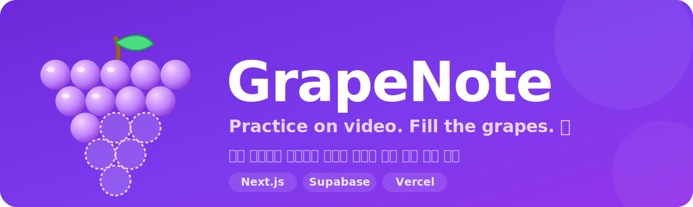

<div align="center">



<br/>

[](https://grapenote.vercel.app)


</div>

---

## 🍇 GrapeNote이 뭐예요?

피아노 학원의 종이 진도카드(포도알 스티커)를 온라인으로 옮긴 웹서비스예요.
지금은 피아노를 넘어 **밴드·악기 연습 전반**의 진도 관리 도구로 쓰이고 있어요.

> **핵심 루프** — 학생이 포도송이 카드의 빈 포도알을 탭 → 연습 영상 촬영/업로드 →
> 선생님(또는 파트장)이 확인 후 **합격**(포도알 채워짐 🍇) 또는 **재연습**(코멘트와 함께 다시 도전 ↺).
> 연습 1회 = 영상 1개 = 포도알 1개.

## ✨ 주요 기능

### 🎹 학생
- **인앱 480p 녹화** (최대 5분) — 촬영 단계에서 화질을 제한해 압축 없이 작은 파일
- 포도알을 눌러 **연습 영상 업로드**, 백그라운드로 올라가며 다른 화면 이동 가능
- **내 포도밭** — 완성한 포도송이 갤러리 + 누적 통계
- 영상별 제목·선생님께 한마디, 검토 대기 영상 다시 찍기, 완성 시 축하 애니메이션

### 🧑‍🏫 선생님
- **현황판** — 곡 × 멤버 편성표. 색으로 진행 상태를 한눈에, 빈칸 클릭으로 곡 배정, 호버로 상세 + 수정
- **검토 몰아보기** — 판정하면 자동으로 다음 영상, 1×/1.5×/2× 배속
- **팀 & 파트장** — 학생을 팀으로 묶고(다중 소속 가능) 팀 단위 숙제 배정, 파트장이 팀원 영상 대리 검토
- 초대코드로 학생 등록(개인/학원 공용), PIN 재설정, 교재 프리셋, 기한 설정

### 🔒 운영
- 판정 후 30일 지난 영상 **자동 정리**(Vercel Cron)로 스토리지 비용 관리
- 데이터 접근은 전부 Postgres RLS + SECURITY DEFINER RPC로 강제

## 🛠 기술 스택

| 영역 | 사용 기술 |
|---|---|
| 프레임워크 | Next.js 16 (App Router, Server Actions), TypeScript |
| 스타일 | Tailwind CSS 4 |
| 백엔드 | Supabase — Auth · Postgres(RLS) · Storage |
| 배포 | Vercel (+ Cron) |
| 테스트 | Vitest (상태 머신 단위) + 실 DB 통합 스모크(`scripts/e2e-live.mjs`) |

## 🚀 시작하기

**1. Supabase 프로젝트 준비**

1. [supabase.com](https://supabase.com)에서 프로젝트 생성 (리전: Seoul 권장)
2. **SQL Editor**에서 `supabase/migrations/`의 SQL을 번호 순서대로 실행
3. **Authentication → Providers → Email** 활성화 + **Confirm email 끄기**
4. **Storage**에 `videos` 버킷은 마이그레이션이 생성 (private, 50MB, `video/*`)
5. **Project Settings → API**에서 키 복사

**2. 로컬 실행**

```bash
cp .env.example .env.local   # 키 3개 채우기
npm install
npm run dev
```

**3. 테스트**

```bash
npm test        # 포도알 상태 머신 단위 테스트 (vitest)
npm run build   # 타입/빌드 검증
```

## 📁 구조

```
supabase/migrations/   # 스키마 · RLS 정책 · SECURITY DEFINER RPC · Storage
src/
  app/                 # 라우트 (teacher / me / student / api)
  lib/
    grapes.ts          # 포도알 상태 유도 (submissions → empty/pending/approved/retry)
    actions/           # 서버 액션 (인증 · 초대 · 카드 · 업로드 · 판정 · 팀)
    supabase/          # client / server / admin(server-only)
  components/          # GrapeBunch(포도송이 SVG) · VideoRecorder · BoardCell · ...
  proxy.ts             # 세션 갱신 + 역할 라우트 가드
```

## 🧑‍🎓 계정 구조

- **선생님** — 이메일 가입 → 온보딩에서 학원 생성
- **학생** — 선생님이 발급한 초대코드로 가입 → 아이디 + 숫자 6자리 PIN
  (내부적으로 `{아이디}@student.grapenote.app` 형식으로 Supabase Auth 사용, 이메일 불필요)

## 🛡 보안 모델

- 모든 데이터 접근은 Postgres **RLS**로 강제 (role/academy_id는 JWT `app_metadata` — 클라이언트 수정 불가)
- 쓰기 중 권한이 민감한 것(제출 생성·판정)은 **SECURITY DEFINER RPC**로만 — 클라이언트가 anon 키로 직접 조작 불가
- 영상 버킷은 private + Storage 정책 없음 — 업로드는 signed upload URL, 재생은 서버 검증 후 signed URL(1시간)
- 초대코드 rate limit, 실명 마스킹 등 무차별 대입 방어

---

<div align="center">
<sub>Made by <a href="https://github.com/Kkackit02">@Kkackit02</a> · 🍇</sub>
</div>
